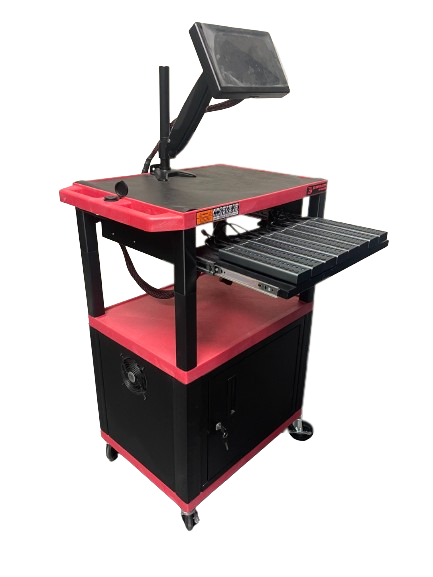

A simple easy-to-use mass USB cloning/duplication GUI application that offers most (often more) 
features commonly found on commercially available products.

# Screenshots

# DV-EZD128

# 12VPM
> 💡Patent pending

The 12V Power Manager manages the power to the USB rails.
This is needed for the CPU to properly discover all USB endpoints.

### 12VPM V1
The first iteration of the power manager involved no more than off-the-shelf products.

### 12VPM V2
The second iteration of the power manager that integrates a temperature control for the cabinet fans.
This was my first PCB design involving two power planes (GND & +5V), case fitment, and functionality.

### 12VPM V3?

TBD.

I plan on getting rid of the Arduino in favor of an STM32 (fully incorporated, no headers for a drop-in).
Maybe add support for a stack light?

# TODO
* Properly document & comment all functions/methods/classes/etc
* Update `update_twelve_vpm()` to support 12VPM V2
* Add temperature settings into `SettingsDialog.py`to support new features of the 12VPM V2
* Improve Connect2Hub.py:`check_for_defective_targets()` function.
* Add quantity acknowledgment after duplicating
* ~~Add splash animation~~
* ~~Exclude trash/recycle files from verification & data-only duplication (e.g. .Trash/*)~~
* Make `CapacityDetailsDialog` look prettier

# Future Features To Implement
* Add webGUI
  * To support features mentioned below and advanced settings for said features
* Add visual QA for labels. OpenCV?
* Add reports
* Add audit information for each imaged target that resides hidden & non-obstructive on the target
  * Create a Windows application to retrieve this information for investigation purposes
* Add ability to print generic lot labels
* Add push notifications
* Add support for checking native NT file permissions via the Master File Table [(MFT)](https://learn.microsoft.com/en-us/windows/win32/fileio/master-file-table)
* Add stack light support
  * Make it compatible for optional use.

# Product Documentation
> 👷‍ WIP

[https://help.ezduplicator.com](https://help.ezduplicator.com)

# Development
The following steps are needed to start hacking away:
1. Install [Ubuntu 20.04](https://ubuntu.com/download/desktop/thank-you?version=20.04.3&architecture=amd64)
2. Download and install
   1. [PyCharm](https://www.jetbrains.com/pycharm/download/#section=linux)
   2. [Glader](https://github.com/welbornprod/glader)
3. Install [Git Commit Template](https://plugins.jetbrains.com/plugin/9861-git-commit-template)
   1. Required to comply with Semantic Versioning Specification ([semver](https://semver.org/))
4. Clone this GitHub repo
   1. In the Welcome to PyCharm wizard, select Get from VCS
5. Run `EZ Duplicator/EZDuplicator/utils/setup.sh` from a terminal to install all necessary system packages.
   1. **NOTE**: `setup.sh` should be run in the same directory in which this README.md file is located in.
6. Download [.pypirc](https://help.ezduplicator.com) and place it into your home directory `/home/<username>/.pypirc`

### Development Cycle
1. Fix/add/improve code.
   1. Use Glade to edit `EZ Duplicator/res/window.ui` (pre-installed by running `setup.sh`)
   2. Use [Glader](https://github.com/welbornprod/glader) to generate Gtk.Dialog/Window/* Classes easily (**NOT** pre-installed by running `setup.sh`. Manual installation and setup required.)
2. Upload wheel package onto the development repository by selecting mkpypi-dev Run/Debug Configuration on the top right-hand corner and running (Shift + F10)
   1. 
3. Test changes on the developer candidate 
   1. Verify developer candidate Update Repository is set to "Development" under Settings > Update Repository 
   2. Changes must pass the following criteria:
      1. It basically shouldn't break/affect any existing code. 
         1. TODO: Draft a document outlining minimum tests required for a pull request to merge with the master branch 
4. Submit a pull request. A pull request must be of significance. This means that each pull request (or commit) must trigger at least a minor (Y) or a patch (Z) bump to the version (X.Y.Z)
   1. Commits will typically be categorized as either a fix or a feature
      1. Use Git Commit Template to submit a proper commit message
5. Upon approval, maintainer will merge pull request with the master branch which triggers GitHub to upload new package onto the custom Production pypi server.

### OTA Updates
There are two repositories where updates are pushed to.
Stable and tested updates are pushed onto the "Production" repository. The "Development" repository is meant to be isolated from
the production repository and where developers can push to test and
develop the application further. This repository is only available to developers only.

**WARNING:** Updates in the "Production" repository are pushed by GitHub via CI/pushes! This means that as a developer
you must be certain that what you push onto GitHub has been tested **100%** and deemed stable enough for production use.
Anything pushed onto the master branch is publicly available as "updates".
Also, verify that the update process does **NOT** brick the product.

### Debug Messages
Accessing debug messages is possible via three methods.
* The first is to use the integrated Debug dialog which can be accessed by tapping the Debug entry in the menu tree.
* The second method is to forward the debug messages to a Syslog server by setting the hostname and port number of the server in the Settings window.
* The third and most convenient, is to access the webtail HTTP server. Open a web browser and go to http://ezduplicator:3565